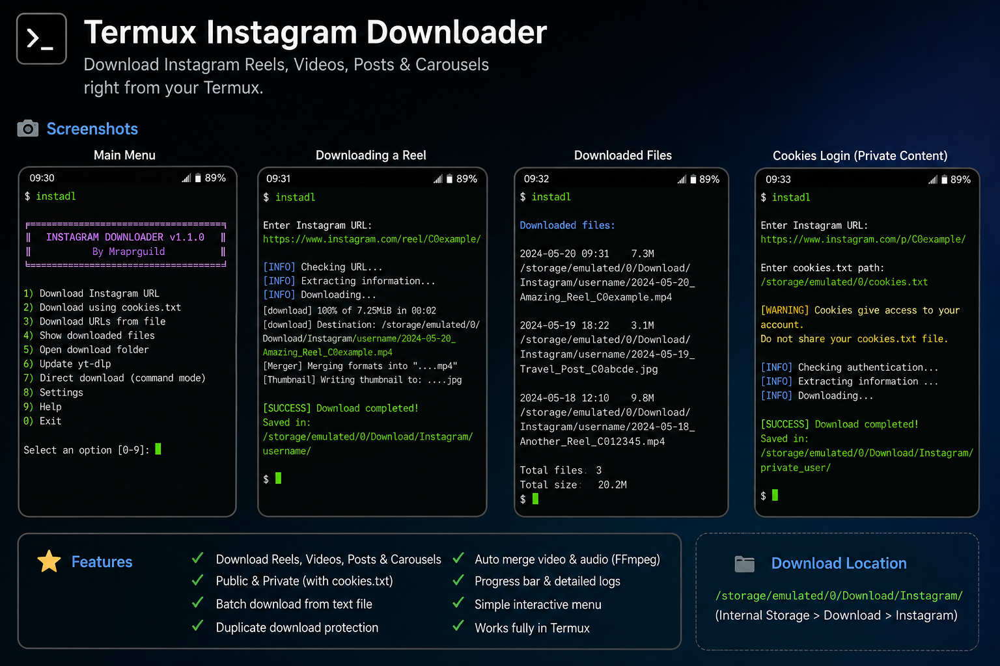

<div align="center">


<a href="https://git.io/typing-svg">
  
</a>

<p>
  <a href="https://github.com/Mraprguild/termux-instagram-downloader/stargazers"></a>
  <a href="https://github.com/Mraprguild/termux-instagram-downloader/network/members"></a>
  <a href="LICENSE"></a>
  
  
</p>

**A modern Termux utility for downloading public Instagram Reels, videos, posts, and carousel media.**

[Installation](#-installation) • [Usage](#-usage) • [Features](#-features) • [Troubleshooting](#-troubleshooting) • [Security](SECURITY.md)

</div>

> [!IMPORTANT]
> Download only media you own or have permission to save. Respect privacy, copyright, Instagram's terms, and applicable law.

---

## 📸 Preview

<div align="center">
  
</div>

---

## ✨ Features

<table>
<tr>
<td width="50%">

### 📥 Downloads

- Instagram Reels and videos
- Photo and video posts
- Carousel media
- Best available quality
- Video and audio merging

</td>
<td width="50%">

### ⚡ Experience

- Interactive terminal menu
- Direct command-line mode
- Batch URL downloading
- Organized creator folders
- Duplicate-download protection

</td>
</tr>
<tr>
<td width="50%">

### 🧰 Included tools

- `yt-dlp` download engine
- FFmpeg media processing
- Thumbnail conversion
- Metadata and JSON files
- Resume interrupted downloads

</td>
<td width="50%">

### 🔐 Account access

- Optional `cookies.txt` support
- Local cookie-file handling
- No credentials stored by this project
- Clear private-content warnings
- Cookie files ignored by Git

</td>
</tr>
</table>

---

## 🚀 Installation

### Install directly from GitHub

```bash
pkg update -y
pkg install git -y
git clone https://github.com/Mraprguild/termux-instagram-downloader.git
cd termux-instagram-downloader
chmod +x install.sh
./install.sh
```

### Install from a downloaded ZIP

```bash
pkg update -y
pkg install unzip -y
unzip termux-instagram-downloader.zip
cd termux-instagram-downloader
chmod +x install.sh
./install.sh
```

Grant Android storage permission when Termux requests it.

<details>
<summary><b>📦 What the installer does</b></summary>
<br>

The installer prepares the required Termux packages, installs or updates `yt-dlp`, configures shared storage, and creates the global command:

```bash
instadl
```

</details>

---

## 🎮 Usage

### Open the animated-style terminal menu

```bash
instadl
```

### Download one Instagram URL

```bash
instadl "https://www.instagram.com/reel/POST_ID/"
```

### Download authorized content using cookies

```bash
instadl --cookies ~/storage/downloads/cookies.txt "INSTAGRAM_URL"
```

### Display help and version

```bash
instadl --help
instadl --version
```

### Menu preview

```text
╔════════════════════════════════════════════╗
║      INSTAGRAM DOWNLOADER v1.1.0          ║
║              By Mraprguild                ║
╚════════════════════════════════════════════╝

  1) Download Instagram URL
  2) Download using cookies.txt
  3) Download URLs from file
  4) Show downloaded files
  5) Open download folder
  6) Update yt-dlp
  0) Exit
```

---

## 📂 Download location

<table>
<tr><th>Location</th><th>Path</th></tr>
<tr><td>Android file manager</td><td><code>Internal Storage/Download/Instagram/</code></td></tr>
<tr><td>Termux</td><td><code>~/storage/downloads/Instagram/</code></td></tr>
</table>

Files are grouped into creator folders when creator information is available.

---

## 📚 Batch downloads

Create a text file containing one Instagram URL per line:

```text
# Lines beginning with # are ignored
https://www.instagram.com/reel/POST_ID_1/
https://www.instagram.com/p/POST_ID_2/
```

Use `urls.example.txt` as a template, then select the batch-download option from the menu.

---

## 🍪 Using cookies safely

Some content that you are authorized to access may require Instagram login cookies in Netscape `cookies.txt` format.

> [!CAUTION]
> A cookies file may provide access to your Instagram account. Never upload it, commit it to GitHub, send it to another person, or store it in a public folder.

The repository `.gitignore` excludes common cookie filenames, but you should still verify files before every commit.

---

## 🔄 Updating

Update the project:

```bash
cd termux-instagram-downloader
git pull
```

Update the downloader engine:

```bash
python -m pip install --upgrade yt-dlp
```

---

## 🛠️ Troubleshooting

<details>
<summary><b>Instagram URL fails to download</b></summary>
<br>

Update `yt-dlp` first:

```bash
python -m pip install --upgrade yt-dlp
```

Then retry the URL. Instagram changes its website frequently, and older extractor versions can stop working.

</details>

<details>
<summary><b>Storage folder is unavailable</b></summary>
<br>

Run:

```bash
termux-setup-storage
```

Allow the Android storage permission, close Termux, reopen it, and run `instadl` again.

</details>

<details>
<summary><b>Private or login-required content fails</b></summary>
<br>

Use your own `cookies.txt` only when you are authorized to view and save the content:

```bash
instadl --cookies /path/to/cookies.txt "INSTAGRAM_URL"
```

</details>

<details>
<summary><b>FFmpeg merge error</b></summary>
<br>

Reinstall FFmpeg:

```bash
pkg reinstall ffmpeg -y
```

</details>

---

## 🗂️ Repository structure

```text
termux-instagram-downloader/
├── .github/
│   ├── ISSUE_TEMPLATE/
│   └── pull_request_template.md
├── assets/
│   └── termux-instagram-downloader-screenshot.png
├── instagram-downloader.sh
├── install.sh
├── uninstall.sh
├── urls.example.txt
├── CHANGELOG.md
├── CONTRIBUTING.md
├── SECURITY.md
├── LICENSE
└── README.md
```

---

## 🧹 Uninstall

```bash
./uninstall.sh
```

This removes the `instadl` launcher. Previously downloaded media is not deleted.

---

## 🤝 Contributing

Bug reports, improvements, documentation fixes, and pull requests are welcome. Read [CONTRIBUTING.md](CONTRIBUTING.md) before submitting changes.

---

## 📜 License

Released under the [MIT License](LICENSE).

---

<div align="center">

### 👨‍💻 Created by Mraprguild

[](https://github.com/Mraprguild)


</div>
